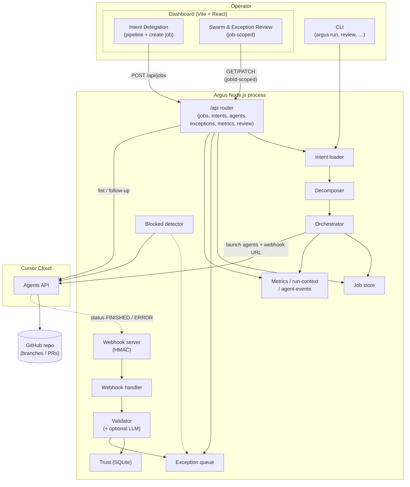

#  Argus

Argus is a reference implementation of **Adaptive Stigmergic Oversight (ASO)** for AI Agent Swarms enabling a single human operator to safely supervise large swarms of AI coding agents running on **Cursor Cloud** via intent-based delegation, stigmergic coordination, and exception-based review.

📄 [Adaptive Stigmergic Oversight: A Scalable Framework for Human Supervision of Large AI Agent Swarms](docs/aso_main.pdf) — the paper this implementation is based on.

## Architecture

Argus is a **Node.js** control plane. It loads **YAML intents**, **decomposes** them into **work packages**, and **launches Cursor Cloud Agents** against your **GitHub** repository. Agents coordinate **stigmergically** via the shared repo (branches and PRs).

On **FINISHED** or **ERROR**, Cursor invokes your **webhook**; Argus **validates** the outcome: it fetches **GitHub Checks** for the agent’s PR head (when `GITHUB_TOKEN` is set) and combines them with metadata checks and optional **LLM** scoring, updates per-agent **trust** in SQLite, and either **auto-approves** or **enqueues an exception** for human review. If Checks are unavailable, validation falls back to metadata-only with a **capped** confidence.

The **Vite + React** dashboard is served from the same Node process behind an **`/api/*` HTTP router**. **Intent Delegation** lists jobs, shows a per-job **pipeline** (intent → decomposer → orchestrator → exception review), and **starts new jobs** with **`POST /api/jobs`** using either a repo **intent file** or an **inline intent** object. That handler runs the **same** load → decompose → launch sequence as **`argus run`**, including an **embedded webhook + tunnel** when no webhook URL is configured, plus a **blocked-agent detector** for those agents.

**Swarm & Exception Review** is **job-scoped**: it reads **`/api/jobs`**, **`/api/agents`**, **`/api/exceptions`**, and **`/api/metrics`** (with optional **`jobId`**), and drives approve/reject and **follow-up** via **`/api/review/*`**. The browser only talks to **`/api/*`**; the server calls the **Cursor Agents API** where needed.

Jobs, exceptions, metrics, run context, validator snapshots (per-agent confidence + checks), and agent events persist under **`.argus/`** (mostly JSON).

**Terminology (paper Layer 3):** **confidence** `c` is the validator’s scalar score in \[0,1\]. **θ** is the single **review threshold** (`reviewThreshold` in YAML, or nested `confidenceGate.reviewThreshold`, or legacy `trustThresholds.autoApprove`). The **merge / policy** decision is **binary**: **c ≥ θ** ⇒ auto-approve; **c < θ** ⇒ human review. **Trust τ** is stored and updated for metrics and learning; it **does not** gate that decision in this release. **Future work:** τ-driven adaptive constraint envelopes (paper §3.2.3) are out of scope for this gate alignment.



## Quick Start

```bash
npm install
npm run build
npm test

# List available intents
npx argus intent list

# Run an intent (requires CURSOR_API_KEY and repository in config)
npx argus run intents/oauth2-auth.intent.yaml
```

## Configuration

1. Copy `argus.config.yaml` to `argus.config.local.yaml`
2. Set `repository` to your GitHub repo URL
3. Set `CURSOR_API_KEY` env var or `apiKeyPath` to a file containing your Cursor API key (from [Cursor Dashboard → Integrations](https://cursor.com/dashboard?tab=integrations))
4. Optional: `GITHUB_TOKEN` (repo scope) so webhooks can read **Check runs** for the agent PR and use real CI results in validation (same family of token as `argus cleanup`). If unset, Argus uses metadata-only validation with a confidence cap.
5. Optional: `OPENAI_API_KEY` env var (or in `.env`) for LLM-based confidence scoring in validation—not in config
6. Optional: `webhookUrl` in config or `-w/--webhook` to use your own webhook (e.g. ngrok). Otherwise `argus run` starts a tunnel automatically.

## Commands

### Run and orchestration
- `argus run <intent-file>` - Decompose intent and launch agent swarm (N=5). Starts a webhook server and tunnel automatically, and launches the oversight dashboard at http://localhost:3848; press Ctrl+C to stop. Detects blocked agents (RUNNING 5+ min with no branch/PR) and adds them to the review queue.
- `argus agents list` - List cloud agents from the Cursor API (filtered by configured repo unless `-a`; newest first, max **100**). **`--job <jobId>`** resolves agents from `.argus/jobs.json` via `GET` per id so your **latest swarm** is visible even when the flat list would be cluttered.
- `argus jobs` - List locally recorded Argus jobs (shows `jobId` for **`agents list --job`**).
- `argus agents delete <agent-id>` - Permanently remove a Cursor cloud agent record (does **not** delete Git branches; use **`argus cleanup`** for those).

### Intents
- `argus intent list` - List available intent files
- `argus intent add <name>` - Create new intent from template

### Review (exception-based human oversight)
- `argus review list` - List exceptions pending review
- `argus review approve <id>` - Approve an exception
- `argus review reject <id>` - Reject an exception
- `argus review show <id>` - Show exception details
- `argus review follow-up <id> <message...>` - Send a follow-up prompt to a blocked agent (e.g. unblock with guidance)

### Infrastructure
- `argus webhook serve` - Start webhook server manually (e.g. with ngrok). Not needed for `argus run`—it starts one automatically.
- `argus ui` - Start the oversight dashboard only (default http://localhost:3848; override with `-p`). `argus run` starts the same UI on port 3848 automatically.
- `argus trust show <agent-id>` - Show trust score for an agent
- `argus cleanup` - Delete all `argus/*`, `cursor/*`, and `codex/*` branches from the configured repo (requires `GITHUB_TOKEN`). Use before re-running demos to avoid polluting the repo. `--dry-run` lists branches without deleting.

## End-to-end demo

### Prerequisites

Do this once before either flow below:

1. Copy `argus.config.yaml` to `argus.config.local.yaml` and set **`repository`** to a GitHub repo you can push to.
2. Set **`CURSOR_API_KEY`** (or **`apiKeyPath`**) as described under **Configuration**.
3. Run **`npm install`** and **`npm run build`** so the dashboard assets exist.
4. Optional: set **`OPENAI_API_KEY`** (or `.env`) if you want LLM-assisted validation scoring.

### CLI-based demo (`argus run`)

From the repo root:

```bash
npx argus run intents/oauth2-auth.intent.yaml
```

This **decomposes** the intent, **launches** five Cursor Cloud Agents, starts an **embedded webhook** and tunnel when no `webhookUrl` is configured, starts the **blocked-agent detector**, and brings up the dashboard at **http://localhost:3848**. In the browser, use **Swarm & Exception Review** (job-scoped metrics, swarm grid, exception queue, activity feed) to approve or reject exceptions and send **follow-up** prompts. **Intent Delegation** is available in the same UI if you want to start additional jobs without restarting the CLI. Press **Ctrl+C** in the terminal to stop the process (webhook tunnel and UI shut down with it).

### UI-based demo (`argus ui`)

Use this when you want the **dashboard to own job creation** (no long-running `argus run` in a terminal):

```bash
npx argus ui
```

Open **http://localhost:3848** (or the port you passed with **`-p`**).

1. **Intent Delegation** — click **+ New Job**, choose **From File** or **Inline**, fill the form, then **Launch Job**. For example, select `intents/oauth2-auth.intent.yaml`. The server runs the same decompose → launch path as the CLI and shows the **pipeline** for that job.
2. **Swarm & Exception Review** — select the job, then watch agents, metrics, and the **exception queue**; use the same controls as in the CLI-driven run for review and follow-up.

Leave **`argus ui`** running until agents finish or you are done inspecting the run.

### Resetting the target repository

Each demo run creates **five branches and pull requests** in the configured repo (Cursor may name branches **`cursor/*`**). To avoid clutter before you demo again:

```bash
# 1. Set GITHUB_TOKEN (repo scope) for the target repo
export GITHUB_TOKEN=ghp_...

# 2. Delete previous Argus/Cursor agent branches
npx argus cleanup

# 3. Run either demo again (CLI or UI)
npx argus run intents/oauth2-auth.intent.yaml
# or: npx argus ui
```

Use **`npx argus cleanup --dry-run`** to list branches that would be deleted without removing them.
