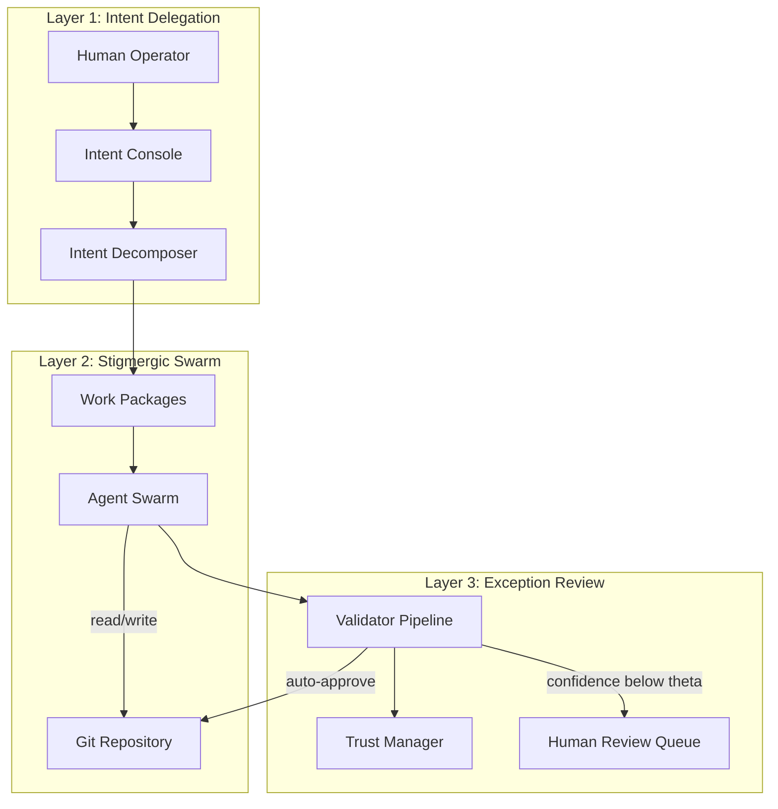

# Argus: Adaptive Stigmergic Oversight Implementation Plan

## Architecture Overview

Argus implements the three-layer ASO framework from [aso_main.pdf](../aso_main.pdf):



---

## Technology Stack

| Component         | Choice                   | Rationale                                                 |
| ----------------- | ------------------------ | --------------------------------------------------------- |
| Runtime           | Node.js 20+ / TypeScript | Cursor API integration, webhook server, CLI tooling       |
| Agent API         | Cursor Cloud Agents API  | Paper targets Cursor; supports launch, status, webhooks   |
| Stigmergic medium | Git branches + PRs       | Per paper Section 6; worktrees/branches provide isolation |
| Trust store       | SQLite                   | Persistent, simple, no external deps                      |
| Config            | YAML                     | Per paper Section 6.1                                     |

---

## Core Components

### 1. Intent Console and Schema

**Location:** `intents/` directory, `argus.intent.yaml` schema

Define intents as YAML per paper Section 6.1:

```yaml
intent: "Implement OAuth2 authentication supporting Google and GitHub"
constraints:
  - use existing auth library
  - follow project coding standards
  - no database schema changes
  - all CI checks must pass
trustThresholds:
  autoApprove: 0.85
  escalate: 0.60
  block: 0.40
```

**Deliverables:**

- Schema (Zod/JSON Schema) for intent validation
- CLI: `argus intent add`, `argus intent list`
- Parser that loads intents and constraint envelopes

---

### 2. Intent Decomposer

**Location:** `src/decomposer/`

Translates high-level intents into policy-bounded work packages. Each work package defines:

- Task description (derived from intent)
- Constraint envelope (quality, scope, approach)
- Permissible action space (files, commands)
- Assigned role (Explorer, Worker, Validator per SwarmSys)

**Approach:** Use LLM (via Cursor API or OpenAI) to decompose intent into N work packages. Alternatively, rule-based decomposition for MVP (e.g., one package per sub-task from a predefined template).

---

### 3. Agent Swarm Orchestrator

**Location:** `src/orchestrator/`

- **Launch:** POST to `https://api.cursor.com/v0/agents` with prompt (work package), source (repo + ref), target (branch name, `autoCreatePr: true`)
- **Isolation:** One branch per agent (e.g., `argus/agent-{id}-{task-slug}`). Cursor Cloud Agents provide isolated cloning; no local worktree management.
- **Coordination:** Agents share the repo; no direct messaging. Stigmergic medium = commits, PRs, CI results
- **Webhook:** Register webhook URL on launch; receive `statusChange` (FINISHED, ERROR) to trigger validation

**Key flow:**

1. Decomposer outputs work packages
2. Orchestrator launches N agents (one per package) via Cloud Agents API
3. Each agent gets unique branch; all read from `main` (or specified ref)
4. On webhook: agent finished → trigger Validator

---

### 4. Validator Pipeline

**Location:** `src/validator/`

Per paper: execute tests, linters, security scans; compute confidence score; auto-merge or escalate.

**Pipeline stages:**

1. **Fetch agent output:** Branch/PR from Cloud Agents API
2. **Run checks:**
   - Unit/integration tests (e.g., `npm test`, `pytest`)
   - Linter (ESLint, Ruff, etc.)
   - Security scan (e.g., `npm audit`, Bandit)
3. **Compute confidence:** Weighted score from check results (tests, linter, security). LLM-based assessment added in Phase 5.
4. **Decision:**
   - confidence >= θ_auto (0.85) → auto-merge (or create PR, mark approved)
   - confidence < θ_escalate (0.60) → add to Human Review Queue with context
   - confidence < θ_block (0.40) → block, do not merge

**Exception payload for human:** Full context, confidence score, validator reasoning, diff, check outputs.

---

### 5. Trust Manager

**Location:** `src/trust/`

Implements Eq. (4) from paper:

```
τ_i(t+1) = α·τ_i(t) + (1-α)·r_i(t)
```

- **Store:** SQLite table `agent_trust` (agent_id, τ, updated_at)
- **Update:** After each cycle, set r_i from validation outcome (e.g., 1 if merged, 0.5 if human-approved after fix, 0 if rejected)
- **Adaptive envelopes:**
  - τ > θ_high (e.g., 0.9): wider constraints, less frequent review
  - τ < θ_low (e.g., 0.5): tighter constraints, mandatory checkpoints

---

### 6. Exception Handler and Human Review Interface

**Location:** `src/review/`

- **Queue:** Persist exceptions (SQLite or JSON) with agent id, branch, confidence, validator output
- **CLI:** `argus review list`, `argus review approve <id>`, `argus review reject <id>`
- **Phase 4:** Minimal web UI for monitoring and human decisions (see Phase 4)

---

### 7. Webhook Server

**Location:** `src/webhook/`

- **Endpoint:** `POST /webhook/cursor-agent`. Test locally with ngrok first; deployment (Fly.io, Railway, etc.) decided later.
- **Verify:** HMAC-SHA256 per Cursor docs
- **On statusChange:** Fetch agent status, trigger Validator, update Trust Manager
- **Return 2xx** quickly; process async

---

## Project Structure

```
argus-swarm/
├── argus.config.yaml          # Global config (API key path, webhook URL, repo)
├── intents/                    # Intent definitions
│   ├── oauth2-auth.intent.yaml   # Demo intent (paper Section 5.1)
│   └── *.intent.yaml
├── src/
│   ├── cli.ts                  # Main CLI entry
│   ├── api/                    # Cursor Cloud Agents API client
│   ├── decomposer/
│   ├── orchestrator/
│   ├── validator/
│   ├── trust/
│   ├── review/
│   └── webhook/
├── package.json
├── tsconfig.json
├── test/
│   ├── decomposer.test.ts
│   ├── intent.test.ts
│   ├── validator.test.ts
│   ├── trust.test.ts
│   ├── review.test.ts
│   └── integration.test.ts
└── README.md
```

---

## Implementation Phases

All phases use CLI as the primary trigger; web UI is introduced in Phase 4.

### Phase 1: Foundation (MVP)

- Project setup (TypeScript, dependencies)
- Cursor Cloud Agents API client (launch, status, list)
- Intent schema and YAML loader
- **Demo intent file:** OAuth2 authentication example from paper Section 5.1 (see below)
- Simple decomposer (1 intent → N=5 work packages for MVP)
- Orchestrator: launch up to 5 agents via Cloud Agents API
- Basic CLI: `argus run <intent-file>`

### Phase 2: Validation and Exception Flow

- Webhook server with signature verification (ngrok for local testing)
- Validator pipeline (tests, linter, security; deterministic confidence scoring)
- Exception queue and review CLI
- Integration: webhook → validate → escalate or auto-merge

### Phase 3: Trust and Scaling

- Trust Manager with SQLite
- Multi-agent launch (N work packages → N agents; N=5 for MVP)
- Adaptive constraint envelopes based on trust
- Metrics collection (exception rate, throughput, etc.)

### Phase 4: Minimal Web UI and Observability

- **Minimal web UI:** Monitor swarm execution (agent status, PRs, exceptions) and provide human decisions (approve/reject) when exceptions require review. Keep UI very minimal.
- Eight metrics from paper Table 1 (swarm throughput, exception rate, human utilization, etc.)
- Dashboard or report generation

### Phase 5: LLM-Based Confidence Scoring

- Add LLM-based assessment to Validator pipeline (e.g., code quality, intent alignment)
- Integrate into confidence score alongside deterministic checks

---

## Demo Intent File (Phase 1)

Create `intents/oauth2-auth.intent.yaml` from paper Section 5.1:

```yaml
intent: "Implement OAuth2 authentication supporting Google and GitHub providers, with 90%+ test coverage and OpenAPI documentation"
constraints:
  - Use the existing authentication library
  - Follow project coding standards
  - Do not modify database schema
  - All CI checks must pass
trustThresholds:
  autoApprove: 0.85
  escalate: 0.60
  block: 0.40
```

This serves as the test intent to demonstrate Argus end-to-end.

---

## Key Design Decisions

1. **Cursor Cloud Agents only:** Use Cloud Agents API exclusively; leverage Cursor's cloning and isolation. No local agent execution.
2. **Validation execution:** Validator runs in Argus process (or separate worker); checks out agent branch, runs tests/linters. Requires repo access (clone or GitHub API).
3. **Confidence scoring:** Deterministic formula (test + linter + security) in Phase 2; LLM-based assessment in Phase 5.
4. **Human review:** CLI-first; minimal web UI in Phase 4 for monitoring and decisions.
5. **Webhook:** Test locally with ngrok; deployment location decided later.

---

## Dependencies (Initial)

- `typescript`, `tsx` (runtime)
- `zod` (schema validation)
- `yaml` (intent parsing)
- `better-sqlite3` or `sql.js` (trust store)
- `express` (webhook server)
- `node-fetch` or `undici` (API calls)
- `commander` or `yargs` (CLI)

---

## Testing

Tests use Node.js built-in test runner (`node --test`) with `tsx` for TypeScript. Run with `npm test`.

### Unit Tests (22 tests)

| Module | File | Coverage |
|--------|------|----------|
| **Decomposer** | `test/decomposer.test.ts` | OAuth intent → 5 work packages with Explorer/Worker/Validator roles; generic intent fallback; `maxPackages` limit; unique package IDs |
| **Intent** | `test/intent.test.ts` | Schema parsing and defaults; YAML loader from file |
| **Validator** | `test/validator.test.ts` | `computeValidationResult`: auto_approve when all checks pass; escalate when 2/3 pass; block on ERROR status; LLM score integration; custom thresholds |
| **Trust store** | `test/trust.test.ts` | get/set trust; exponential smoothing (τ update); clamping to [0, 1] |
| **Review store** | `test/review.test.ts` | add/list/resolve exceptions; pending-only filter |

Tests use `ARGUS_STORE_DIR` to isolate trust and review stores in temp directories.

### Integration Test (1 test)

**File:** `test/integration.test.ts`

Uses undici `MockAgent` to intercept Cursor API requests (no real network calls). Verifies:

1. Load intent from YAML
2. Decompose into work packages
3. `listAgents` (mocked GET /v0/agents)
4. `validate` (mocked GET /v0/agents/:id) → auto_approve decision
5. Add exception to review queue
6. List pending exceptions

---

## Recent Enhancements (Latest Version)

The following enhancements extend the original implementation plan and reflect the current ASO Control Hub.

### Job Model and Data Layer

- **Job store** (`src/jobs/store.ts`): First-class job records with `jobId`, `intentSummary`, `status`, `agentIds`, `workPackages`. Persisted in `.argus/jobs.json`.
- **Run-context association**: Each agent is associated with a `jobId` in run-context; `getAgentIdsByJob(jobId)` retrieves agents per job.
- **Agent-events store** (`src/agent-events/store.ts`): Stores `finishedAt` per agent for accurate activity feed timestamps.
- **Job completion detection**: Webhook handler calls `checkJobCompletion` when agents reach terminal states; `GET /api/jobs` proactively updates job status as a fallback.

### UI: Vite + React Migration

- **Stack**: Migrated from static HTML to Vite + React + TypeScript SPA. Build output in `dist/ui/app/`.
- **Two-tab layout**: **Intent Delegation** (Intents) and **Swarm & Exception Review** (Swarm), with consistent job selection in both.
- **Branding**: Argus logo, full product name, and description in top bar; tab name under main view title.

### Intent Delegation Tab

- **Job list** (left): Jobs with status, intent summary, agent count, intent file, timestamp.
- **Pipeline diagram**: Animated stages — Intent Defined → Decomposer → Orchestrator → Calculating Stigmergic Metrics → Create Exception Review.
- **ASO Layer 2/3**: Show gray (pending) until orchestrator completes; then transition to done.
- **New Job modal**: Popup with "From File" / "Inline" modes; intent file dropdown from `intents/`; trust thresholds (autoApprove, escalate, block).
- **Launch UX**: Modal closes immediately on "Launch Job"; optimistic job addition; pipeline shown right away.

### Swarm & Exception Review Tab

- **Job-specific views**: All data (metrics, agents, exceptions, activity) scoped to the selected job.
- **Metrics strip**: Fan-out, exception rate, throughput/hr, trust mean, containment — all computed per job when `jobId` is provided.
- **Agent swarm grid**: Dots by status (running/finished/error/blocked/creating); hover to show work package card and PR link.
- **Exception Review Queue**: Approve/reject/follow-up; "+ Test" button to add synthetic exceptions for demos.
- **Activity feed**: Uses `finishedAt` for accurate per-agent completion timestamps.

### Backend API Extensions

- **Jobs API**: `GET /api/jobs`, `GET /api/jobs/:jobId`, `POST /api/jobs` (decompose, launch, create job record).
- **Intents API**: `GET /api/intents`, `GET /api/intents/:name`, `PUT /api/intents/:name`.
- **Config API**: `GET /api/config`, `PUT /api/config` — read/write `argus.config.local.yaml`.
- **Test exceptions**: `POST /api/exceptions/test` — creates synthetic exception for first agent of a job (for demo/testing).
- **Filtered endpoints**: `/api/agents`, `/api/exceptions`, `/api/metrics` accept optional `?jobId=` for job-scoped data.

### Settings and Configuration

- **Settings modal** (gear icon in sidebar): Configure repository, Cursor API key path, webhook URL/secret, default branch, max agents, OpenAI API key path.
- **Config persistence**: `saveConfig()` writes to `argus.config.local.yaml`; `openaiApiKeyPath` added for future LLM decomposer.

### Demo and Testing Aids

- **Exception-test intents**: `intents/exception-test.intent.yaml`, `intents/exception-test-strict.intent.yaml` for triggering or testing exception flow.
- **Demo script**: `docs/demo-script.md` — under-10-minute presentation guide for students.

### Project Structure (Updated)

```
argus-swarm/
├── argus.config.yaml / argus.config.local.yaml
├── intents/
│   ├── oauth2-auth.intent.yaml
│   ├── exception-test.intent.yaml
│   ├── exception-test-strict.intent.yaml
│   └── *.intent.yaml
├── src/
│   ├── cli.ts
│   ├── api/
│   ├── decomposer/
│   ├── orchestrator/
│   │   └── run-context.ts          # jobId per agent
│   ├── jobs/                       # Job store
│   │   └── store.ts
│   ├── agent-events/               # finishedAt per agent
│   │   └── store.ts
│   ├── validator/
│   ├── trust/
│   ├── review/
│   ├── webhook/
│   └── ui/
│       └── server.ts               # API + static SPA
├── ui/                            # Vite + React SPA
│   ├── src/
│   │   ├── App.tsx
│   │   ├── main.tsx
│   │   └── index.css
│   ├── vite.config.ts
│   └── package.json
├── .argus/
│   ├── jobs.json
│   ├── agent-events.json
│   ├── run-context.json
│   ├── exceptions.json
│   ├── metrics.json
│   └── trust.db
└── docs/
    ├── demo-script.md
    └── ...
```

---

## Resolved Decisions

- **Repository access:** TBD (local clone vs GitHub API for validation)
- **Agent limit:** N=5 for MVP
- **Webhook:** ngrok for local testing; deployment decided later
