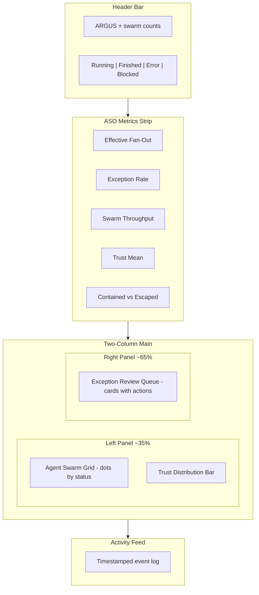
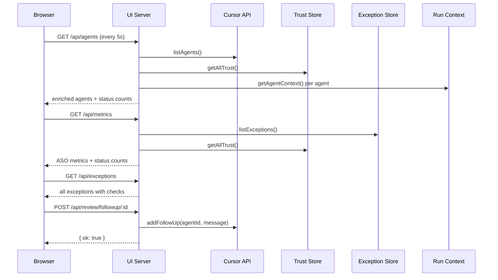

# Argus Oversight Dashboard

## Design Philosophy

The ASO paper defines three cognitive modes for the human operator: **intent formulation**, **exception review**, and **swarm health monitoring** (Eq. 3, cognitive budget). The UI should minimize time in monitoring mode (low Cmeta) and maximize efficiency of review mode (low Creview per exception) so the operator spends most time on strategic intent work.

**Key principles:**

- **Overview first, details on demand** -- hundreds of agents are shown as a compact grid, not individual cards
- **Exception-driven workflow** -- the review queue is the largest and most prominent panel
- **Metrics as ambient awareness** -- the 8 ASO metrics sit in a persistent header strip, always visible

---

## Layout Architecture

---

## ASO Metrics (Paper Table 1) -- What We Can Compute

| Paper Metric          | Source               | Computation                                                             |
| --------------------- | -------------------- | ----------------------------------------------------------------------- |
| **Swarm Throughput**  | Agent list           | Count of FINISHED agents per hour (from `createdAt` timestamps)         |
| **Exception Rate**    | Metrics store        | `exceptions / totalAgents` -- already tracked                           |
| **Effective Fan-Out** | Derived from Eq. 2   | `N * (1 - Pe * Tr/Tc)` where Pe = exception rate, Tr = 2min, Tc = 15min |
| **Trust Mean**        | Trust DB             | Average tau across all agents                                           |
| **Error Containment** | Exception store      | Ratio of auto-approved to total (proxy metric)                          |
| **Coordination Cost** | Not yet instrumented | Show placeholder "N/A"                                                  |
| **Adaptation Speed**  | Not yet instrumented | Show placeholder "N/A"                                                  |
| **Intent Fidelity**   | Not yet instrumented | Show placeholder "N/A"                                                  |

Five of eight metrics are computable from existing data. The remaining three display as "N/A" with tooltips explaining what instrumentation is needed.

---

## File Changes

### 1. New file: `src/ui/dashboard.html`

A single self-contained HTML file (no build step) with embedded CSS and JS. Served by the existing Node HTTP server.

**Visual design:**

- Dark theme (ops/monitoring convention) with CSS custom properties
- Monospace accent font for metrics, clean sans-serif for text
- Color coding: green (healthy/auto-approved), amber (escalate), red (blocked/error), blue (running), gray (finished)
- Compact agent grid: each agent is a small colored dot/cell in a flex-wrap container -- scales to hundreds without scrolling
- Exception cards: bordered left with severity color, showing agent name, decision badge, confidence bar, failed checks, and action buttons (Approve / Reject / Follow-up)
- Metric tiles: number + label + target indicator (green check if within target, amber warning if not)

**Interactions:**

- Click an agent dot to see detail popover (name, intent, branch, PR, trust, status, time running)
- Exception cards have inline Approve/Reject buttons (POST to existing endpoints)
- Follow-up button opens a text input to send a prompt to the blocked agent
- Auto-refresh every 5 seconds via `setInterval` + `fetch`
- Responsive: collapses to single-column on narrow screens

### 2. Modified: `src/ui/server.ts`

**Serve the dashboard:**

- Read `dashboard.html` at startup (via `import.meta.url` relative path) instead of inline HTML string
- Serve it on `GET /`

**Enrich `GET /api/agents`:**

- Include `name`, `summary`, `createdAt`, `source.repository` from the Cursor API response
- Look up trust score via `getTrust(agentId)` for each agent
- Look up intent context via `getAgentContext(agentId)` for each agent
- Return enriched objects: `{ id, name, status, branch, prUrl, summary, createdAt, trust, intent }`

**New endpoint: `GET /api/trust`:**

- Return all trust scores as `{ agentId, tau, updatedAt }[]`
- Requires reading from the SQLite trust store

**Enrich `GET /api/metrics`:**

- Add computed ASO metrics:
  - `effectiveFanOut`: N * (1 - Pe * 2/15) from Eq. 2
  - `throughputPerHour`: FINISHED agents in last hour
  - `trustMean`: average tau
  - `containmentRatio`: auto-approved / (auto-approved + escalated + blocked)
- Return `statusCounts`: `{ running, finished, error, blocked, creating }`

**Enrich `GET /api/exceptions`:**

- Include `all` parameter option (not just pending) so the activity feed can show resolved items
- Already returns full check details, confidence, decision

**New endpoint: `POST /api/review/followup/:id`:**

- Accept `{ message: string }` body
- Look up exception to get agentId
- Call `addFollowUp(agentId, apiKey, { text: message })`
- Return success/failure JSON

### 3. Modified: `src/trust/store.ts`

**New export: `getAllTrust()`:**

- Query all rows from `agent_trust` table
- Return `Array<{ agentId: string; tau: number; updatedAt: string }>`
- Needed by the enriched `/api/agents` and `/api/trust` endpoints

---

## Data Flow

---

## Dashboard Sections Detail

**Header:** "ARGUS" logo + total agent count + status pills (Running: N, Done: N, Exceptions: N)

**Metrics strip:** 5 computable metrics as tiles. Each tile shows: large number, label, target range, pass/fail indicator. 3 future metrics shown as dimmed tiles.

**Agent swarm grid (left panel):**

- Each agent = 12x12px circle in a flex-wrap container
- Color: blue=RUNNING, green=FINISHED, red=ERROR, amber=BLOCKED, gray=CREATING
- Border intensity reflects trust: solid border = high trust, dotted = low trust, no border = no trust data
- Hover tooltip: agent name + status + elapsed time
- Click: popover with full details (intent, branch, PR link, trust score, summary)

**Exception review queue (right panel):**

- Cards sorted: blocked first, then escalate, then block (by severity)
- Each card: colored left border, decision badge, agent name, confidence as a mini progress bar, list of failed checks, action buttons
- "Follow-up" button (for blocked agents) expands an inline text input
- Resolved exceptions shown collapsed at bottom with resolution badge

**Activity feed (bottom):**

- Reverse-chronological event stream
- Shows: timestamp, agent name, event (status change, exception added, exception resolved, follow-up sent)
- Max ~20 recent events, scrollable

---

## Implementation Todos

1. Add `getAllTrust()` export to `src/trust/store.ts` to query all trust scores from SQLite
2. Enrich `/api/agents`, `/api/metrics`, `/api/exceptions` in `src/ui/server.ts`; add `/api/trust`, `POST /api/review/followup/:id`
3. Create `src/ui/dashboard.html` with dark-theme ops dashboard: metrics strip, agent grid, exception queue, activity feed
4. Update `server.ts` to serve `dashboard.html` from disk instead of inline HTML string
5. Verify TypeScript compiles and lint passes on modified files
